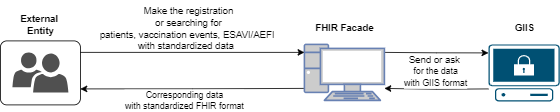

A more human readeable way of seing the whole scenario is looking at this diagram. 
However, if you want to get more into the technical things, [this section of the guide](transaction.html) is for you.

The external entities will have the possibility of making the registration and/or the searching of a patient, vaccination event and an ESAVI/AEFI with standardized data. 

Once this data is sent, the FHIR Facade will transform the data for the API only when it's necessary, as it is for the cases of registration of patients and vaccination events, and send it to the GIIS for it to be registered into the database. 

Also, the FHIR Facade will make the data interoperable through the FHIR resource profiles, which whenever the external entity ask for them or receives them will also become standardized data. 

As for the GIIS, it will be the responsible for making the saving of the data, so everything from there is going to be handled internally and the FHIR Facade will not modify any of the internal work or any business rule/logic from the GIIS. 